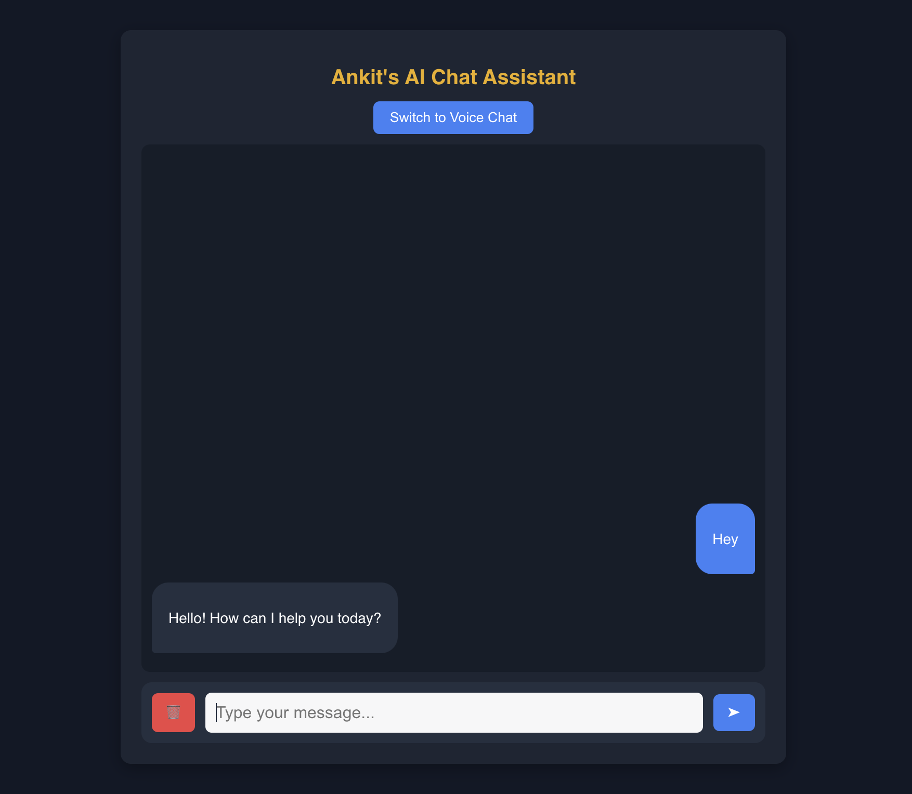
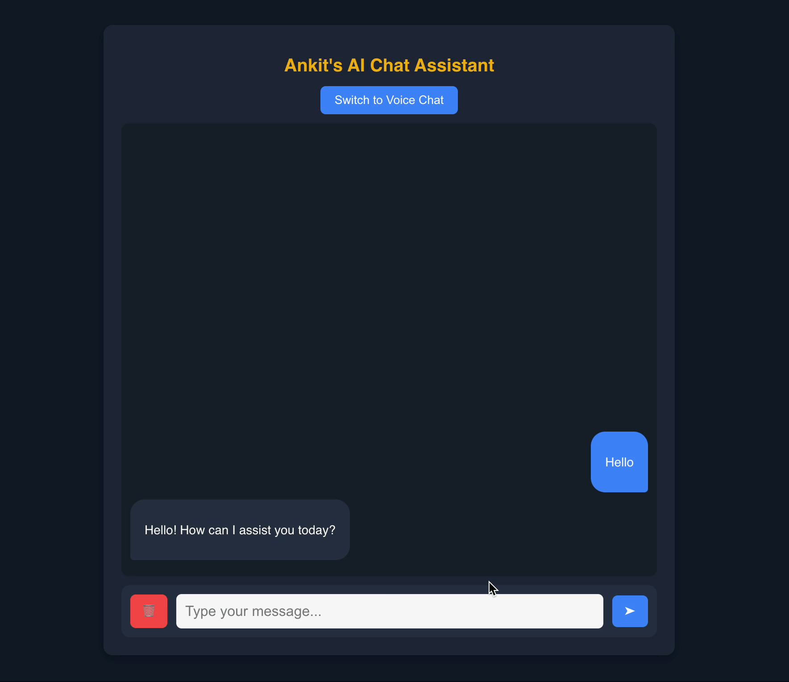
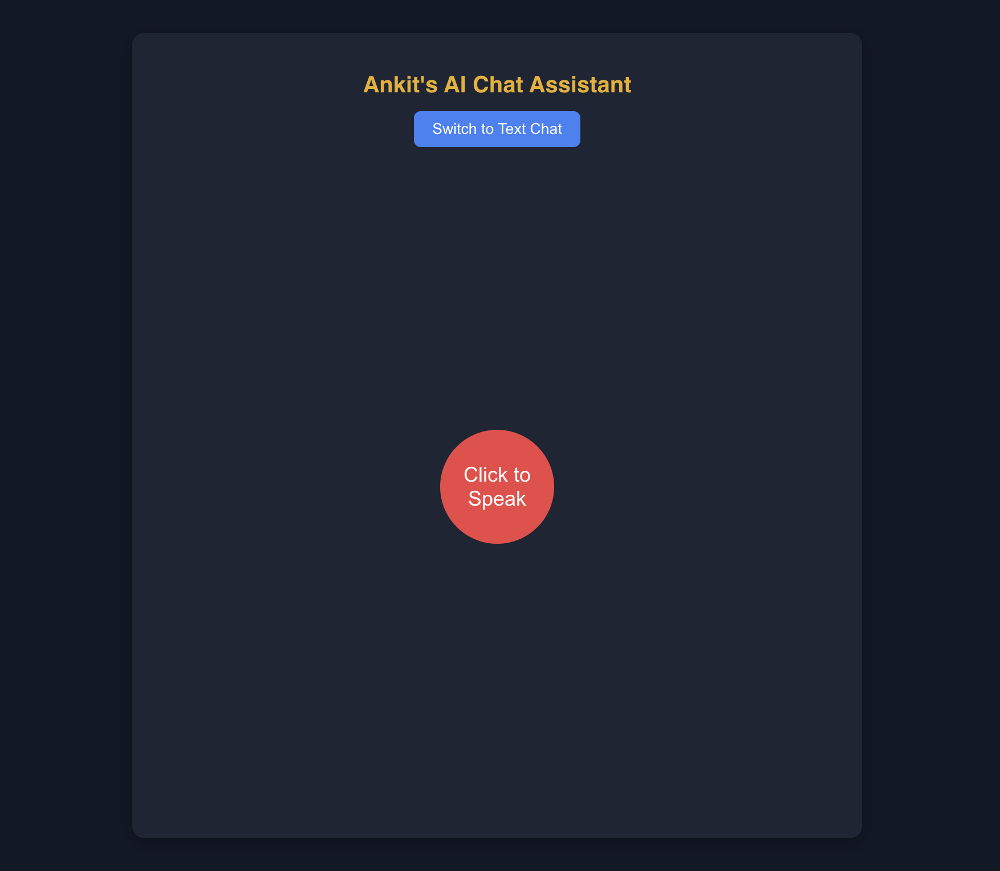
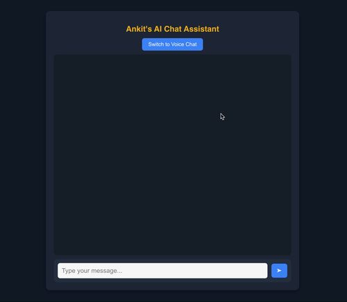

# AI Chatbot

This is a custom AI chatbot application built using **React.js** for the frontend and **Flask** for the backend. The chatbot leverages **LangChain** for retrieval-augmented generation (RAG) using **ChromaDB** as a vector store, and it integrates with **Hugging Face** and **Grok AI** for embeddings and responses. It now supports retaining chat history and switching between text-to-text and voice-to-voice chat modes.

## Features

- **Contextual Chat History**:  
  The application stores recent conversations in a local SQLite database so that your chat history is preserved and can be used to enhance context in subsequent interactions.

- **Dual Interaction Modes**:

  - **Text Chat**: Engage in traditional text-based conversations with a typewriter effect for responses.
  - **Voice Chat**: Use voice commands with your browser’s SpeechRecognition API and listen to responses synthesized via a dedicated TTS endpoint powered by the Cartesia API.

- Uses **ChromaDB** to retrieve relevant context from a knowledge base.
- Implements **Hugging Face embeddings** for vector search.
- Connects to **Grok AI** to generate responses.
- Provides a **CORS-enabled Flask backend** to seamlessly communicate with the React frontend.

---

## Screenshots









---

## Tech Stack

### Frontend

- **React.js** (with Hooks & State Management)
- **CSS** (for styling)
- **Fetch API** (to communicate with backend)

### Backend

- **Flask** (REST API framework)
- **Flask-CORS** (for handling cross-origin requests)
- **LangChain** (for vector search and embeddings)
- **ChromaDB** (for vector storage)
- **Hugging Face** (for embeddings API)
- **Grok AI API** (for chatbot responses)
- **Cartesia API** (for high-quality text-to-speech conversion)

---

## Installation & Setup

### Prerequisites

- Node.js and npm (for frontend)
- Python 3.8+ (for backend)
- A virtual environment (`venv`) for Python (recommended)
- API keys for **Hugging Face**, **Grok AI**, and **Cartesia** stored in `api_key.json` in the backend.

### Backend Setup

1. Clone this repository:

   ```sh
   git clone https://github.com/ankitrijal2054/AI_Chatbot.git
   cd AI-Chatbot

   ```

2. Navigate to the backend directory:

   ```sh
   cd backend
   ```

3. Create and activate a virtual environment:

   ```sh
   python -m venv venv
   source venv/bin/activate   # On Windows, use: venv\Scripts\activate
   ```

4. Install dependencies:

   ```sh
   pip install -r requirements.txt
   ```

5. Add your API keys in a file called `api_key.json`:

   ```json
   {
     "HUGGINGFACE_API_KEY": "your-huggingface-api-key",
     "XAI_API_KEY": "your-grok-ai-api-key",
     "CARTESIA_API_KEY": "your-cartesia-api-key"
   }
   ```

6. Run the backend server:
   ```sh
   python chatbot.py
   ```
   The Flask server should now be running on `http://localhost:5001`.

---

### Frontend Setup

1. Navigate to the frontend directory:

   ```sh
   cd frontend
   ```

2. Install dependencies:

   ```sh
   npm install
   ```

3. Start the frontend application:
   ```sh
   npm start
   ```
   The React app should now be running on `http://localhost:3000`.

---

## Usage

1. Open the React frontend (`http://localhost:3000`).
2. **Text Chat Mode:**
   - Type your message in the input box and press Enter or click the send button.
   - The chatbot will respond using retrieved knowledge and chat history and store the new conversation in the database.
3. **Voice Chat Mode:**
   - Click the "Switch to Voice Chat" button to enable voice mode. In this mode:
   - Click "Click to Speak" to start voice recognition.
   - Speak your query, and the chatbot will process it.
   - Listen to the AI response synthesized through the TTS endpoint.
4. To clear the chat history, click the 🗑️ button in text chat mode. This action removes all stored conversations from both the UI and the backend database.

---

## Future Improvements

- Deploy frontend & backend to **Railway**.
- Add support for more complex **memory-based conversations**.
- Improve **error handling & logging**.

---

## Contributing

Pull requests are welcome! If you find any issues, please open an **issue** or submit a **PR**.

---

## License

This project is licensed under the **MIT License**.

---

## Author

**Ankit Rijal**
